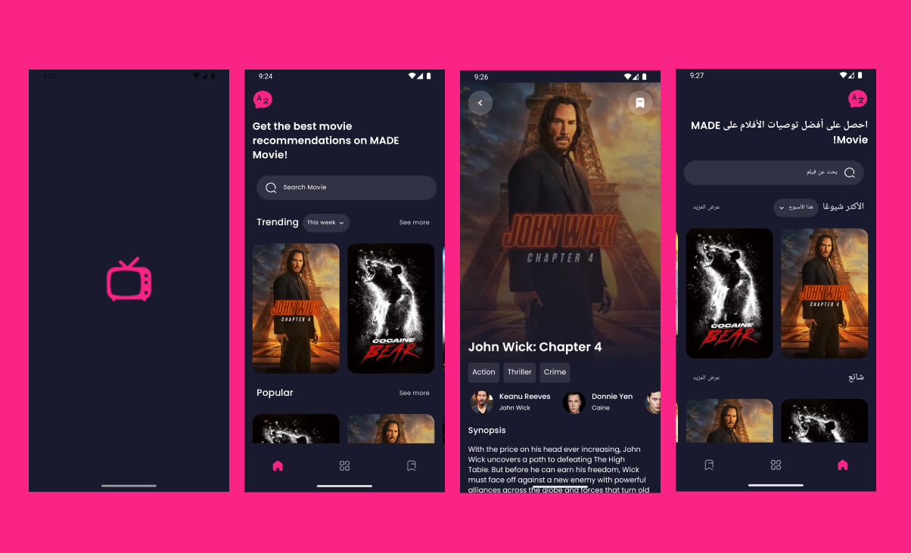

<h1 align="center">MADE Movie</h1>
<p align="center">Submission Dicoding <a href="https://www.dicoding.com/academies/165">Menjadi Android Developer Expert (MADE)</a>, modern Android Development dengan Koin, Coroutines, Flow, Jetpack, Modularization, Unit Testing dan Dynamic Feature Module.</p>

<br>

<p align="center" width="100%">
    
</p>

<br>

## Tech Stack

- Jetpack
    - [Navigation Component](https://developer.android.com/jetpack/androidx/releases/navigation)
    - [Paging3](https://developer.android.com/jetpack/androidx/releases/paging)
    - [Room](https://developer.android.com/jetpack/androidx/releases/room)
    - [Data Binding](https://developer.android.com/jetpack/androidx/releases/databinding)
    - [Work Manager](https://developer.android.com/jetpack/androidx/releases/work)
    - [Startup](https://developer.android.com/jetpack/androidx/releases/startup)
    - [Splashscren](https://developer.android.com/jetpack/androidx/releases/core#core-splashscreen-1.0.0)
- [Material Design](https://m2.material.io/)
- [Retrofit](https://github.com/square/retrofit)
- [Gson](https://github.com/google/gson)
- [Koin](https://insert-koin.io/)
- [Timber](https://github.com/JakeWharton/timber)
- [Sandwich](https://github.com/skydoves/sandwich)
- [PowerMenu](https://github.com/skydoves/powermenu)
- [Glide](https://bumptech.github.io/glide/)
- [MMKV](https://github.com/Tencent/MMKV)
- [Mockito](https://site.mockito.org/)

<br>

## Setup Project

1. Clone atau Download project dan buka di Android Studio.
2. Dapatkan kunci API [TMDB API](https://www.themoviedb.org/).
3. Cari file local.properties dan tambahkan variabel berikut:
```properties
API_KEY_THE_MOVIE_DB = "YOUR_API_KEY"
```

<br>

## Thanks

Inspiration [Pokedex](https://github.com/skydoves/Pokedex) by [Skydoves](https://github.com/skydoves)

<br>

## Original Design

[k-Drama Streaming App](https://dribbble.com/shots/17142577-K-Drama-Streaming-App) by [Vetrick Wilsen](https://dribbble.com/vetrickwilsen)

